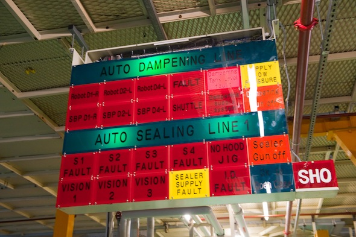
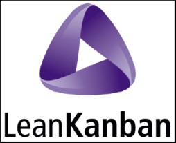
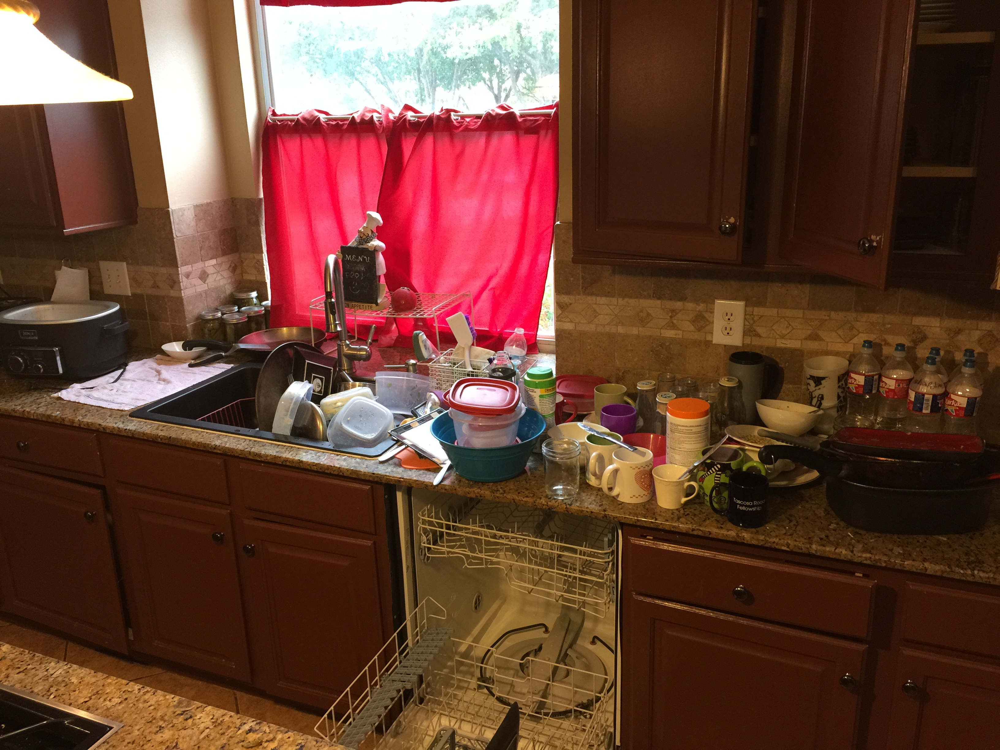
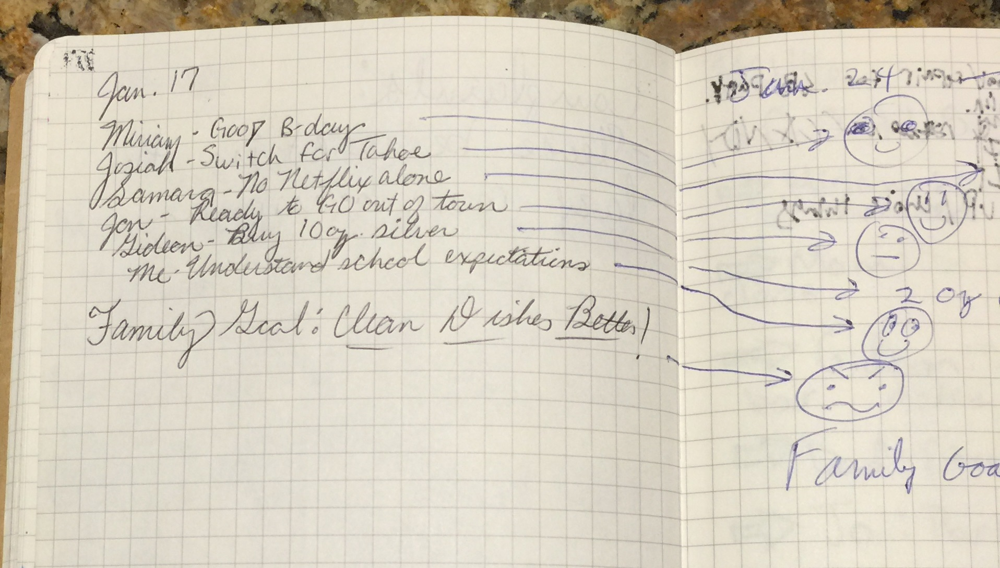
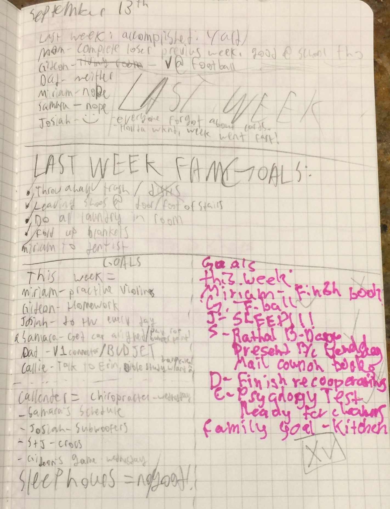
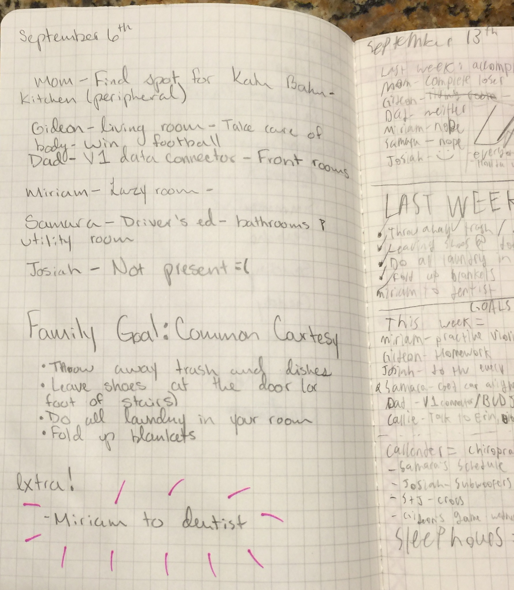
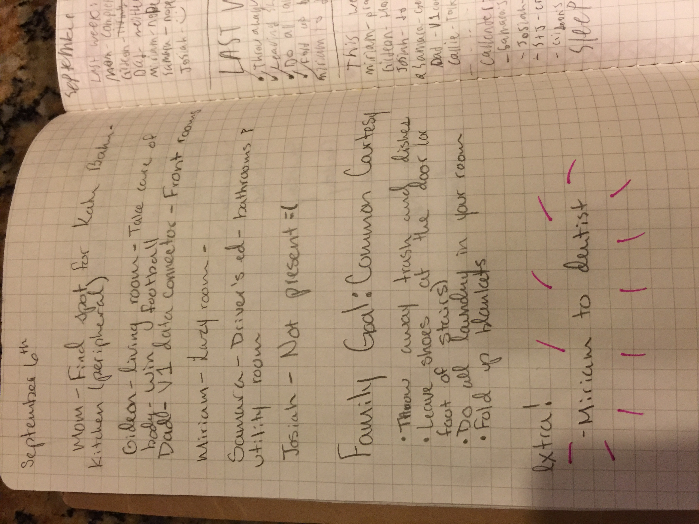
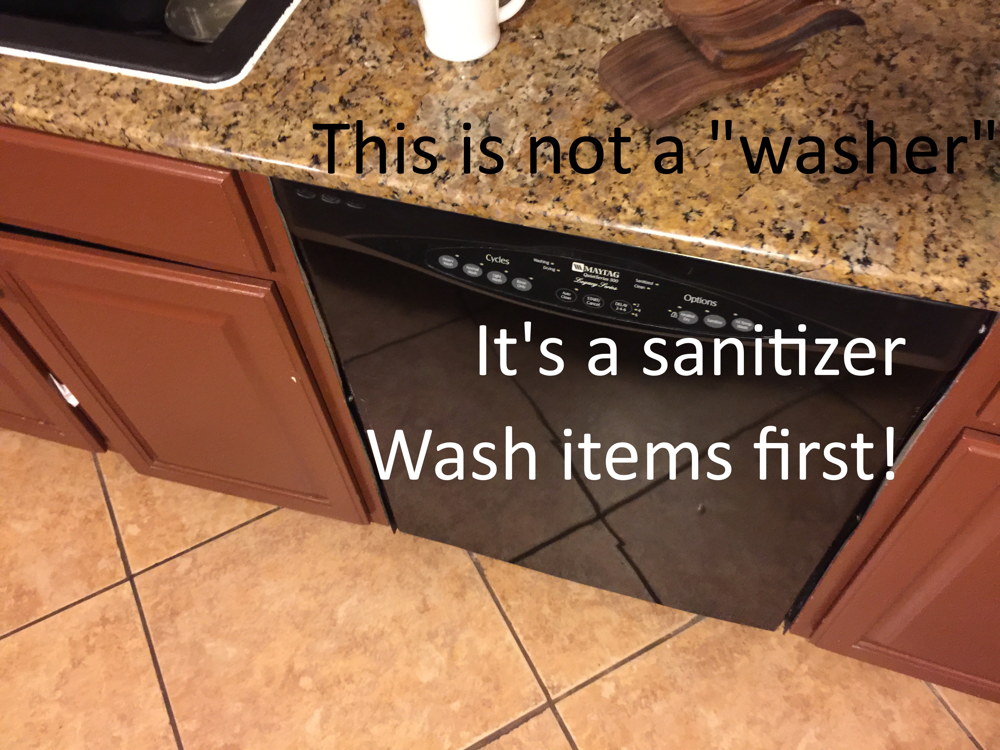
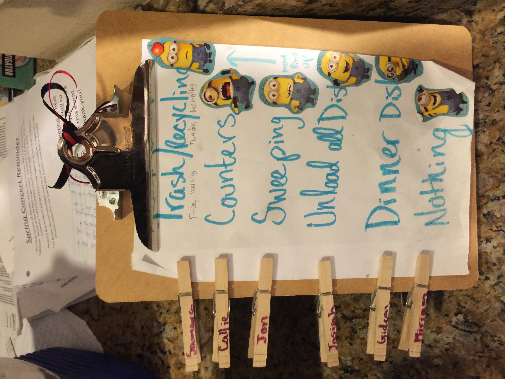
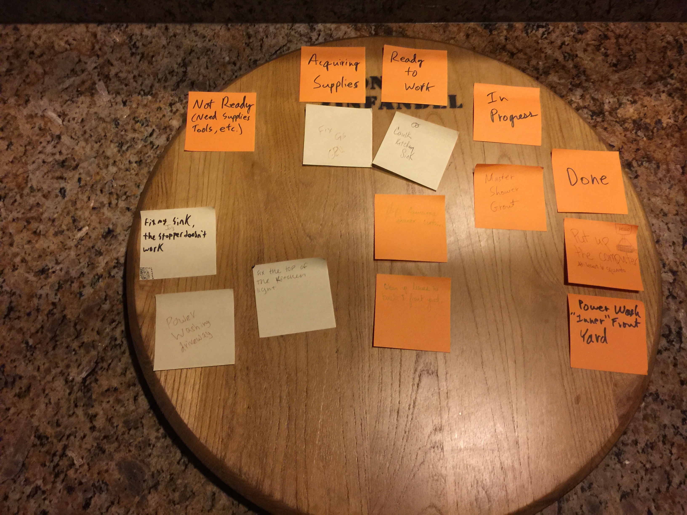

- title : Intro To Kanban
- description : Introduction to Kanban
- author : Jon Roberts
- theme : moon
- transition : default

***

# What is Kanban?

***

## Word Origin is Japanese

> **Literal Translation of 看板**: signboard

***

## But It's Different Than Kanban for Manufacturing

***
## Origins of Kanban for Knowledge Work

- Began with David Anderson using "Drum-Buffer-Rope" Method at Microsoft in 2004
- More Info: http://www.djaa.com/brief-history-kanban-knowledge-work

***

## The Kanban Method
### Principles

1. Start with what you do now
1. Agree to pursue incremental, evolutionary change
1. Respect the current process, roles, responsibilities & titles
1. Encourage acts of leadership at all levels in your organization

***

## The Kanban Method
### General Practices

1. Visualize (the work, workflow and business risks)
2. Limit WIP
3. Manage Flow
4. Make Process Explicit
5. Implement Feedback Loops
6. Improve Collaboratively, Evolve Experimentally (using models & the scientific method)

***

## Example:
### Kanban at Home

---

### Kanban at Home
### The Team (age when started experiment)

- Dad (more than 30)
- Mom (less than 40)
- Samara (16)
- Josiah (15)
- Gideon (13)
- Miriam (11)

---

### Kanban at Home
Is this Kanban?

---
### Kanban at Home
Yes, it can be!

---

### Cultural Obstacles to
### Kanban at Home
- Dictatorship (Rigid Hierarchy)
- Closed Culture (Dissent/Conflict is discouraged or punished)
- Boring Meetings
- Only Ideas From the Leadership (Mom and Dad)
- Too Many Ideas From Leadership (Selling Ideas to Rank and File)

---

### Kanban at Home
### Initial Target Areas
- Laundry
- Dishes

---

### Kanban at Home
### Observations and Learnings
- Had to be OK allowing some experiments that we "knew" wouldn't work
- Took longer than initially anticipated for buy-in and ownership

---

### Kanban at Home
### Kaizen With Weekly Meetings
- logs kept
- leader rotates

---

### Kanban at Home
### Meeting Log Example

---

### Kanban at Home
### Meeting Log Example

---

### Kanban at Home
### Meeting Log Example

---

### Kanban at Home
### Meeting Log Example

---

### Kanban at Home
### Learning and Experimenting

---

### Kanban at Home
### Innovations
- Chore Chart
- Dirty Dish

---

### Kanban at Home
### Chore Chart

---

### Kanban at Home
### Dirty Dish

---

### Kanban at Home today

***
